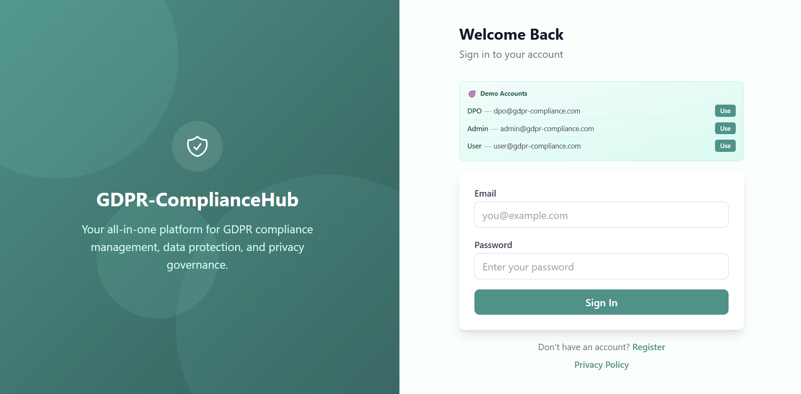
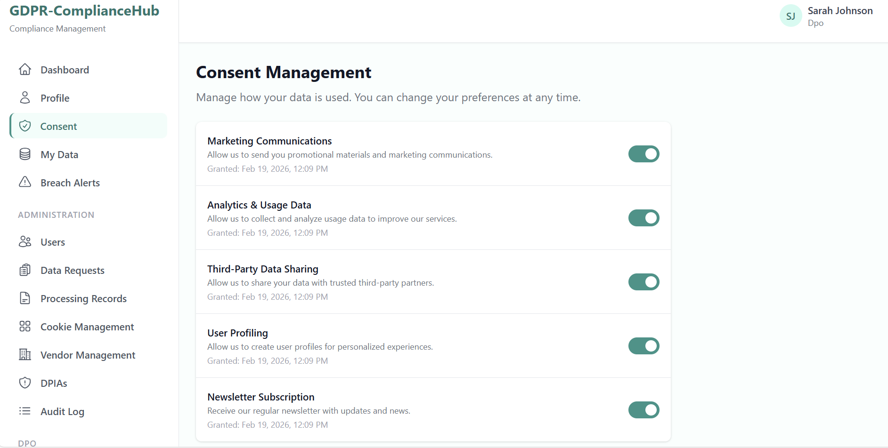
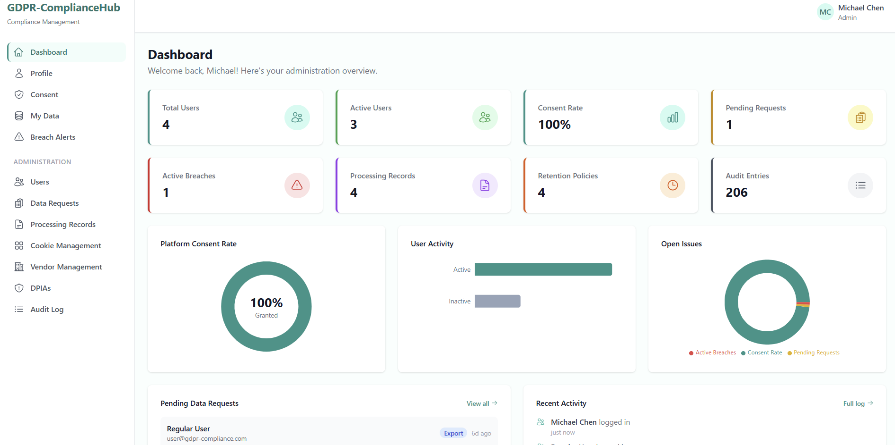
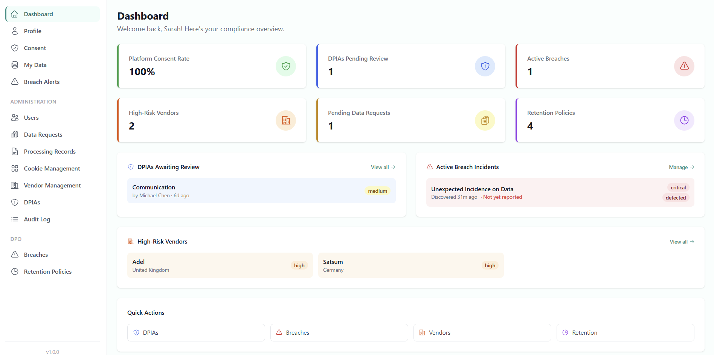
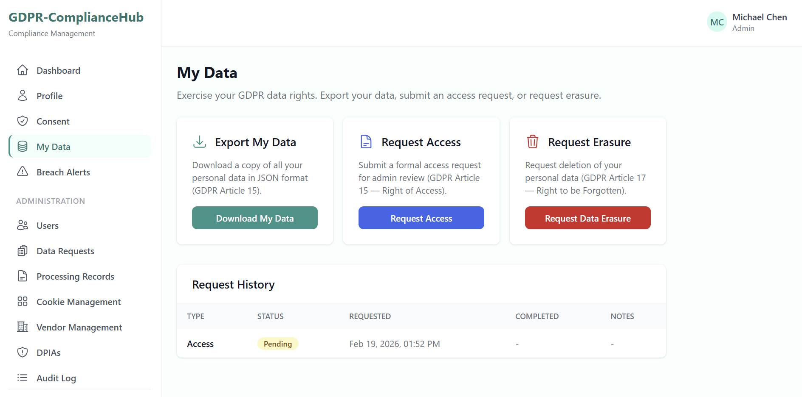
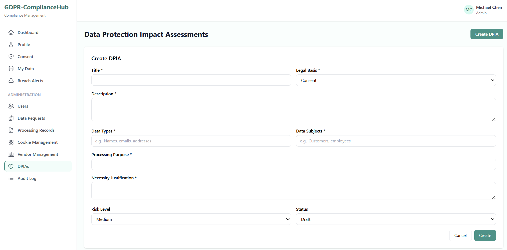
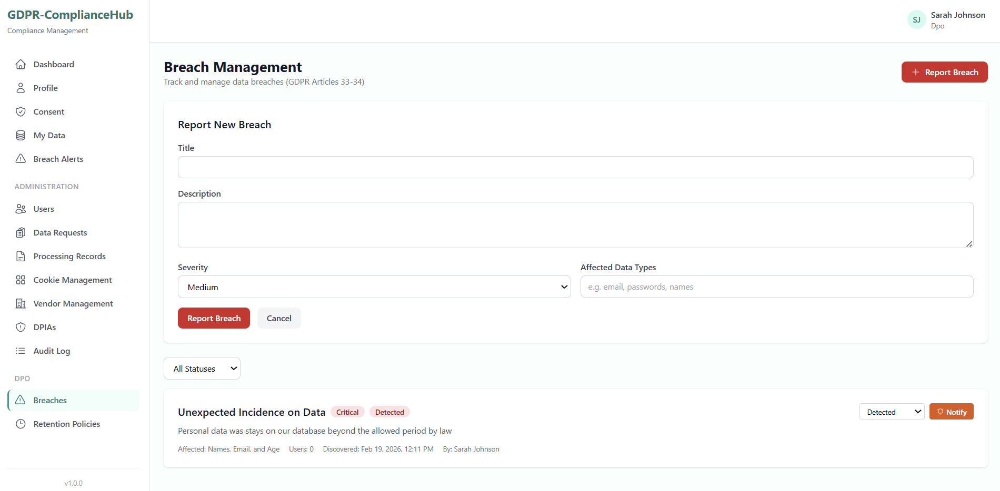
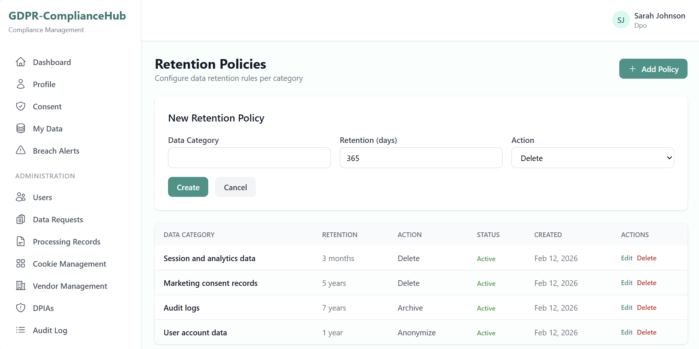
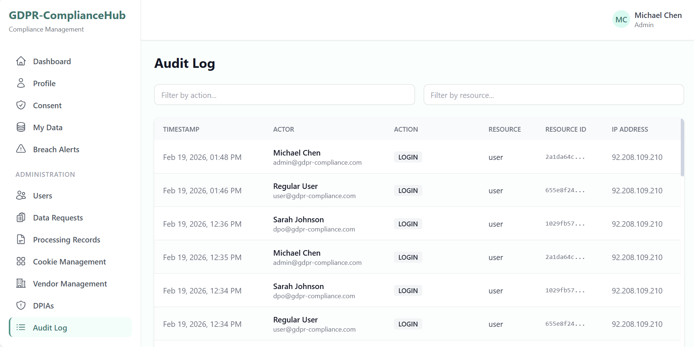

# GDPR-ComplianceHub

**A full-stack data privacy management platform that translates GDPR legal obligations into a working software system** — consent management, data subject rights, breach notifications, vendor risk tracking, DPIAs, and a complete audit trail.

Built to demonstrate the ability to architect compliance-grade software: multi-role access control, immutable audit logging, data anonymisation workflows, and structured regulatory mapping across GDPR Articles 6–35.

[](https://gdpr-compliancehub.vercel.app)
[](https://github.com/adeleke-taiwo/GDPR-ComplianceHub)


> **[Try it live](https://gdpr-compliancehub.vercel.app)** — demo accounts with click-to-fill are available on the login page.

---

## Screenshots

| | |
|:---:|:---:|
|  |  |
| **Login** — Demo accounts with click-to-fill credentials | **Consent Management** — Granular per-purpose toggles with history |
|  |  |
| **Admin Dashboard** — Platform-wide stats, user counts, consent rates | **DPO Dashboard** — DPIAs pending review, high-risk vendors, active breaches |
|  |  |
| **My Data** — Data export and erasure request workflows | **Vendor Management** — Sub-processor tracking, risk levels, DPA status |
|  |  |
| **DPIAs** — Risk scoring, mitigations, approval workflow | **Breach Management** — Severity tracking, 72h reporting, user notifications |
|  |  |
| **Retention Policies** — Per-category retention rules with anonymise/delete/archive actions | **Audit Log** — Immutable trail of every sensitive operation |

---

## What This Project Demonstrates

| Skill Area | Implementation |
|:-----------|:---------------|
| **Full-Stack Architecture** | Next.js 15 App Router with 41+ API routes, 13 server services, and 15 Prisma models |
| **Authentication** | Dual-token JWT — short-lived access tokens + httpOnly refresh cookies with automatic silent refresh |
| **Authorization** | Granular RBAC (User / Admin / DPO) enforced at both middleware and API route level |
| **Database Design** | 15 relational models with referential integrity, transactional operations, and Neon serverless pooling |
| **Regulatory Mapping** | GDPR Articles 6–35 translated into concrete features — consent versioning, data portability, breach timelines |
| **Security** | bcrypt hashing, Zod validation on every endpoint, audit logging with actor/IP/timestamp, data anonymisation on erasure |
| **Frontend State** | TanStack Query for server state (caching, background refetch), React Context for auth |
| **Production Deployment** | Vercel (frontend + serverless API) + Neon PostgreSQL (serverless, connection pooling) |

---

## Key Features

### User Portal
| Feature | GDPR Article |
|:--------|:-------------|
| Granular consent management (5 purposes, toggle per item) | Art. 7 |
| Real-time consent rate dashboard (personal %) | Art. 7 |
| Personal data export (structured JSON download) | Art. 15, 20 |
| Right to erasure request with admin review workflow | Art. 17 |
| Breach alert notifications with acknowledgement | Art. 34 |
| Privacy policy with full transparency disclosures | Art. 13–14 |

### Admin Portal
| Feature | Notes |
|:--------|:------|
| User management (activate, deactivate, change role) | Role-based access guards |
| Data request processing (approve/reject erasure & access) | Full audit trail |
| Processing Records (ROPA) management | Art. 30 compliance |
| Cookie registry with first/third-party categorisation | ePrivacy |
| Vendor/sub-processor tracking with DPA management | Art. 28 |
| Platform-wide consent rate analytics | Recharts visualisation |
| Audit log (immutable, filterable, paginated) | All sensitive operations |

### DPO Portal
| Feature | Notes |
|:--------|:------|
| Dedicated compliance dashboard (DPIAs, breaches, high-risk vendors) | Role-specific view |
| Data Protection Impact Assessments with risk scoring | Art. 35 |
| DPIA risk matrix (likelihood x impact, 1–5 scale) | Automated risk level |
| Mitigation tracking with status workflow | Planned → Complete |
| Active breach management with 72-hour authority reporting | Art. 33 |
| High-risk vendor monitoring | Art. 28 |
| Retention policy configuration (anonymise/delete/archive) | Art. 5(1)(e) |

---

## Tech Stack

| Layer | Technology | Purpose |
|:------|:-----------|:--------|
| **Framework** | Next.js 15 (App Router) | Full-stack React with serverless API routes |
| **Frontend** | React 19 + TypeScript | Component-based UI with type safety |
| **Styling** | Tailwind CSS 4 | Utility-first responsive design |
| **Server State** | TanStack Query v5 | Caching, background refetch, optimistic updates |
| **Forms** | React Hook Form + Zod | Performant forms with schema validation |
| **Charts** | Recharts | Interactive consent rate and analytics visualisations |
| **Database** | Neon PostgreSQL (serverless) | Serverless Postgres with connection pooling |
| **ORM** | Prisma 6 + Neon adapter | Type-safe queries with serverless driver |
| **Auth** | JWT (jose) + bcrypt | Dual-token stateless auth with httpOnly refresh cookies |
| **Deployment** | Vercel | Zero-config Next.js hosting with edge middleware |

---

## Architecture

```
┌──────────────────────────────────────────────────────────────┐
│                  Next.js 15 App Router                        │
│                                                              │
│  ┌─────────────┐  ┌─────────────┐  ┌──────────────────────┐ │
│  │  19 Pages   │  │ Components  │  │  Client Services     │ │
│  │ (dashboard) │  │Layout+Common│  │  13 Axios modules    │ │
│  └──────┬──────┘  └─────────────┘  └──────────┬───────────┘ │
│         │          TanStack Query v5           │             │
│─────────┼──────────────────────────────────────┼─────────────│
│         │         API Routes (/api/v1/)        │             │
│  ┌──────┴──────┐  ┌─────────────┐  ┌──────────┴───────────┐ │
│  │  41+ Routes │──│13 Services  │  │    Middleware         │ │
│  │             │  │business logic│  │ JWT · RBAC · Audit   │ │
│  └─────────────┘  └──────┬──────┘  │ Zod · Error Handler  │ │
│                          │         └──────────────────────┘ │
└──────────────────────────┼──────────────────────────────────┘
                           │  Prisma 6 + Neon Adapter
                           ▼
                 ┌──────────────────────┐
                 │  Neon PostgreSQL     │
                 │  15 models · 8 enums │
                 └──────────────────────┘
```

### API Endpoints (41+ routes)

| Endpoint | Purpose | Access |
|:---------|:--------|:-------|
| `POST /api/v1/auth/*` | Register, login, token refresh, logout, password change | Public |
| `GET/PATCH /api/v1/consent/*` | Consent preferences and history | User |
| `GET/POST /api/v1/data-requests/*` | Access & erasure requests | User + Admin |
| `GET /api/v1/data-export/my` | Download personal data as JSON | User |
| `GET/PATCH /api/v1/users/*` | User management and role changes | Admin/DPO |
| `GET/POST /api/v1/processing-records/*` | ROPA management | Admin/DPO |
| `GET/POST /api/v1/cookies/*` | Cookie registry & consent tracking | Admin/DPO |
| `GET/POST /api/v1/vendors/*` | Vendor & sub-processor management | Admin/DPO |
| `GET/POST /api/v1/dpias/*` | DPIA lifecycle with risks & mitigations | Admin/DPO |
| `GET/POST /api/v1/breaches/*` | Breach management & user notifications | Admin/DPO |
| `GET/POST /api/v1/retention-policies/*` | Data retention rules | Admin/DPO |
| `GET /api/v1/audit-logs` | Immutable activity log | Admin/DPO |
| `GET /api/v1/dashboard/stats` | Role-adaptive statistics | All roles |

### GDPR Compliance Mapping

| Article | Requirement | Implementation |
|:-------:|:------------|:---------------|
| **Art. 6** | Lawful basis for processing | Legal basis tracked per processing record (6 bases) |
| **Art. 7** | Conditions for consent | Granular per-purpose consent with timestamps, IP, and version |
| **Art. 13–14** | Transparency obligations | Privacy Policy page with full disclosures |
| **Art. 15** | Right of access | Data export as structured JSON |
| **Art. 17** | Right to erasure | Erasure request workflow; data anonymised on completion |
| **Art. 20** | Data portability | Structured JSON export of all personal data |
| **Art. 28** | Processor obligations | Vendor registry with DPA tracking and sub-processor management |
| **Art. 30** | Records of processing | ROPA management with legal basis and retention |
| **Art. 33–34** | Breach notification | Breach reporting, 72h deadline tracking, user alerts |
| **Art. 35** | Impact assessments | Full DPIA workflow with risk scoring and mitigation tracking |

---

## Roles & Permissions

| Capability | User | Admin | DPO |
|:-----------|:----:|:-----:|:---:|
| Manage own profile & consent | Y | Y | Y |
| Export / request erasure of own data | Y | Y | Y |
| View breach alerts | Y | Y | Y |
| Manage users | — | Y | Y |
| Process data requests | — | Y | Y |
| Manage processing records (ROPA) | — | Y | Y |
| Manage cookie registry | — | Y | Y |
| Manage vendors & sub-processors | — | Y | Y |
| Create & manage DPIAs | — | Y | Y |
| View audit logs | — | Y | Y |
| Manage breaches & notify users | — | — | Y |
| Configure retention policies | — | — | Y |
| Dedicated compliance dashboard | — | — | Y |

---

## Getting Started

### Prerequisites
- Node.js 18+
- PostgreSQL 14+ (or a Neon account)

### Installation

```bash
# Clone
git clone https://github.com/adeleke-taiwo/GDPR-ComplianceHub.git
cd GDPR-ComplianceHub

# Install dependencies
npm install

# Configure environment
cp .env.example .env.local
# Edit .env.local — set DATABASE_URL, DIRECT_DATABASE_URL, JWT secrets

# Set up database
npx prisma db push
npx prisma generate

# Run development server
npm run dev
```

Open `http://localhost:3000` and sign in with a demo account from the login page.

---

## Security Highlights

- **JWT rotation** — short-lived access tokens (15 min) + long-lived refresh tokens (7 days) stored in httpOnly cookies
- **Password hashing** — bcrypt with 12 salt rounds
- **Input validation** — Zod schemas on every POST/PATCH endpoint; invalid requests rejected before hitting services
- **RBAC** — role checked at both middleware and API route level; no client-side trust
- **Audit logging** — every sensitive mutation logged with actor ID, IP address, timestamp, and resource details
- **Data anonymisation** — erasure requests replace PII with anonymised placeholders, preserving relational integrity
- **Middleware protection** — server-side auth check redirects unauthenticated users before page content is served

---

## About Me

I'm a full-stack developer who builds clean, production-ready applications with modern technologies. This project demonstrates my ability to translate complex regulatory requirements into working software — from database design and secure API development through to responsive frontend implementation.

**Looking for opportunities** to contribute to impactful products with a collaborative team.

- GitHub: [@adeleke-taiwo](https://github.com/adeleke-taiwo)

---

## License

This project is open source and available under the [MIT License](LICENSE).
